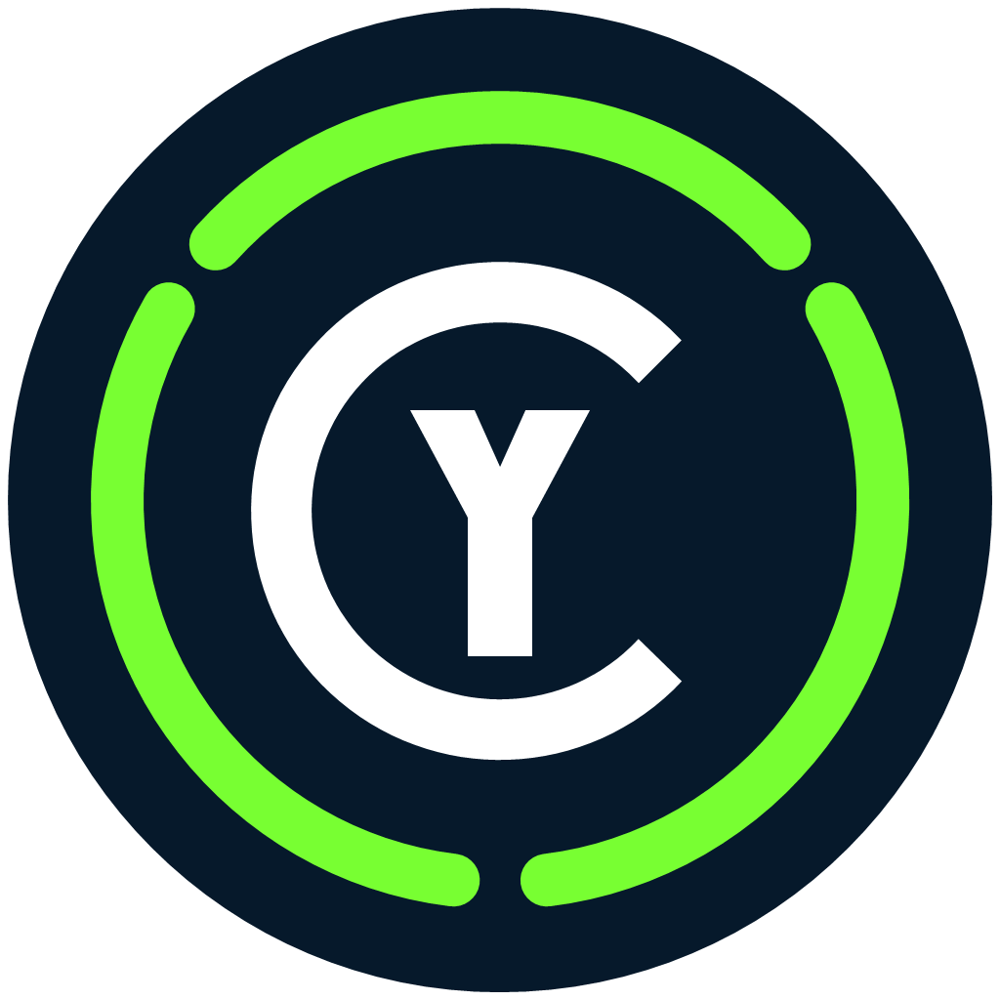

# CyCapture

<p align="center">
  
</p>

<p align="center">
  <a href="#français">Français</a> · <a href="#english">English</a>
</p>

## Français

CyCapture est un outil de capture discret écrit en **C# avec Avalonia 12** et ciblant Windows en priorité. [CyAnnota](https://github.com/MrMybal/CyAnnota) reste un projet séparé ; son ouverture après capture passe uniquement par un plugin CyCapture facultatif.

### Utilisation

Au lancement, CyCapture reste dans la zone de notification et n’ouvre pas une grande interface.

1. Appuyez sur `Impr. écran`.
2. En mode hybride, relâchez la touche rapidement pour ouvrir directement la sélection intelligente d’image, ou maintenez-la pendant le délai configuré pour afficher la palette près de la souris.
3. Dans la palette, choisissez **Image**, **Vidéo**, **GIF** ou **Audio**, ainsi que la qualité et le style de sélection souhaités.
4. Pour annoter une image rapidement, choisissez d’abord dessin, cadre, flèche ou texte, annotez librement l’écran figé, puis revenez sur `⌖` pour réactiver la sélection.
5. Effectuez la sélection demandée : l’image est capturée immédiatement avec les annotations visibles dans la zone. Le mode Audio démarre immédiatement avec les sources activées dans les réglages (son système et/ou microphone).
6. Pour une vidéo, un GIF ou un audio, appuyez à nouveau sur `Impr. écran` pour arrêter.

Pendant l’enregistrement, l’icône du tray devient rouge, son infobulle affiche `REC` et la durée, et le menu du tray propose aussi l’arrêt. Le cadre rouge et son petit minuteur sont placés hors de la zone enregistrée et sont marqués comme exclus de la capture Windows.

Un clic droit sur l’icône du tray permet de lancer directement une capture d’image, une capture vidéo, un GIF ou un enregistrement audio. Les modes visuels ouvrent la sélection intelligente ; l’audio démarre immédiatement.

Le même menu contient maintenant des entrées séparées pour la **Galerie** et les **Réglages**. Un clic sur une image, un GIF, une vidéo ou un fichier audio l’ouvre en grand dans la galerie ; les médias animés se lisent directement avec leurs commandes de lecture. La galerie peut afficher les captures d’aujourd’hui, d’hier ou la liste complète, et chaque fichier peut être copié dans le presse-papiers. Après une capture, la notification reste cliquable pendant six secondes pour ouvrir directement le fichier.

### Fonctions de la version Avalonia

- application tray-first, sans fenêtre principale imposée ;
- remplacement natif de `Impr. écran` par un hook clavier Windows intégré au processus C# ;
- palette Image / Vidéo / GIF / Audio au niveau de la souris ;
- fluidité vidéo, débit H.264, encodage audio, format/qualité d’image, qualité GIF et style de sélection directement modifiables dans la palette ;
- modes de sélection Intelligente, Fenêtre, Écran et Zone libre ;
- respect des occlusions et du Z-order Windows : une fenêtre cachée derrière une autre n’est plus sélectionnée ;
- réglages classés par onglets Image, Vidéo, GIF et Audio dans les paramètres et la palette rapide ; son vidéo et audio seul indépendants ;
- annotations rapides facultatives sur l’écran figé avant la capture d’image : dessin libre, cadre, flèche, texte, couleurs, annulation et effacement ;
- comportement de `Impr. écran` configurable : palette ou démarrage direct Image/Vidéo/GIF/Audio ;
- mode hybride `Impr. écran` : appui court pour ouvrir la sélection intelligente d’image, maintien configurable de 0,1 à 1 seconde pour ouvrir la palette des modes ;
- commandes Image/Vidéo/GIF/Audio directement accessibles par clic droit sur le tray ;
- galerie locale avec visionneuse agrandie, lecture Image/GIF/Vidéo/Audio, filtres Aujourd’hui/Hier/Tout et copie dans le presse-papiers ;
- organisation facultative des captures par type (`Images`, `Videos`, `GIFs`, `Audio`) et/ou par dossier quotidien `AAAA-MM-JJ` ;
- notifications de fin de capture cliquables ;
- entrée `Réglages…` dédiée dans le menu du tray ;
- sélection intelligente de la fenêtre, de sa zone cliente et de contrôles internes ;
- sélection libre et sélection d’écran ;
- prise en charge des bureaux multi-écrans décalés et du DPI par moniteur ;
- capture image PNG sans perte ou JPEG à 40, 70 ou 90 %, avec copie dans le presse-papiers ;
- vidéo MP4 H.264 via Media Foundation, avec débit indépendant de 1 à 12 Mbit/s, son système et microphone optionnels ;
- capture audio seule du son système et/ou du microphone, encodée en MP3 de 96 kbit/s mono à 192 kbit/s stéréo avec repli WAV ;
- copie facultative des vidéos dans le presse-papiers Windows comme fichiers, compatible avec l’Explorateur et les logiciels acceptant les pièces jointes ;
- GIF direct avec profils compact, équilibré et haute qualité ;
- tray normal vert et tray d’enregistrement rouge avec minuterie ;
- historique local et métadonnées configurables : intégrées au média par défaut, base centrale, JSON adjacent ou aucune métadonnée ;
- plugins C# de post-traitement via `ICapturePostProcessor` dans `%LOCALAPPDATA%\CyCapture\Plugins` ;
- activation et configuration individuelles des plugins depuis les réglages ;
- contribution facultative des plugins sous forme de case globale dans le tray et la palette rapide ;
- édition complète avec le plugin **CyAnnota Post Edit** et CyAnnota 0.3.9 intégrés, édition sans CyAnnota et plugin autonome distribuable séparément ;
- petite fenêtre de réglages accessible depuis le tray ;
- version et édition affichées dans les réglages, avec vérification et téléchargement sécurisé des mises à jour GitHub ;
- lancement facultatif de CyCapture avec Windows, directement dans la zone de notification de l’utilisateur courant ;
- instance unique : relancer CyCapture ouvre les réglages de l’instance existante.

### Compiler

Prérequis : SDK .NET 8 ou plus récent et Windows x64.

```powershell
git clone https://github.com/MrMybal/CyCapture.git
cd CyCapture
dotnet restore CyCapture.sln --runtime win-x64
dotnet build CyCapture.sln -c Release
```

### Produire les paquets Windows locaux

```powershell
./scripts/publish-windows-local.ps1
```

Le script place dans `dist-local` :

- `CyCapture-1.4.7-windows-x64.exe`, édition complète avec CyAnnota ;
- `CyCapture-1.4.7-windows-x64-without-CyAnnota.exe`, édition légère sans CyAnnota ni son entrée de plugin ;
- `CyCapture.Plugin.CyAnnota-0.3.9.dll` et son archive ZIP, installables dans `%LOCALAPPDATA%\CyCapture\Plugins`.

Les exécutables sont autonomes et produits en fichier unique. Le moteur LibVLC est inclus pour la lecture directe des médias dans la galerie. ScreenRecorderLib utilise Media Foundation et demande le Media Feature Pack sur une édition Windows N/KN qui ne l’inclut pas.

### Architecture et portabilité

L’interface, les modèles et le pipeline de plugins utilisent Avalonia/C#. Les services `Platform/Windows` contiennent le hook clavier, l’énumération des fenêtres et la capture Windows. Cette séparation permettra d’ajouter plus tard des implémentations macOS et Linux sans refaire l’interface.

Ce dossier de travail contient uniquement la version native Avalonia/C#. Les anciens fichiers Electron sont restés dans le dossier de migration d’origine et ne font pas partie de ce projet.

### Métadonnées et intégration CyAnnota

Le plugin **Manifeste de capture** permet de choisir son stockage depuis les réglages :

- **Intégré au média** : écrit dans le PNG, JPEG, GIF ou MP4 sans ajouter de JSON dans le dossier des captures ; pour un MP3/WAV, la métadonnée est automatiquement rangée dans la base centrale ;
- **Base centrale** : écrit dans `%LOCALAPPDATA%\CyCapture\Metadata` ;
- **JSON adjacent** : conserve le comportement historique `.cycapture.json` ;
- **Aucune métadonnée** : ne produit aucun manifeste.

Le plugin **CyAnnota Post Edit** ne modifie aucun fichier source de [CyAnnota](https://github.com/MrMybal/CyAnnota). L’édition complète et le DLL autonome embarquent la distribution Windows CyAnnota 0.3.9. CyCapture l’extrait une seule fois dans `%LOCALAPPDATA%\CyCapture\Bundled\CyAnnota` en arrière-plan, puis lance directement `CyAnnota.exe` : aucune installation séparée ni association `cyannota://` n’est nécessaire. L’édition sans CyAnnota n’embarque ni le logiciel ni le plugin. Lors d’un premier lancement, CyCapture attend que la fenêtre soit prête avant de lui transmettre le média.

Le plugin reste désactivé par défaut. Une fois activé, sa case **PostEdit with CyAnnota** est synchronisée entre les réglages, le tray et la palette rapide. Un exécutable CyAnnota personnalisé peut toujours être choisi dans les réglages. Les GIF sont ignorés tant qu’ils ne sont pas pris en charge par CyAnnota.

Le contrat générique destiné aux autres plugins est décrit dans [`PLUGIN_API.md`](PLUGIN_API.md).
Les informations de licence et de provenance du binaire intégré figurent dans [`BUNDLED_COMPONENTS.md`](BUNDLED_COMPONENTS.md).

### Licence

Copyright © 2026 CyberAlien.

CyCapture est distribué sous la **GNU Affero General Public License v3.0 uniquement** (`AGPL-3.0-only`). Le texte complet est disponible dans [`LICENSE`](LICENSE).

---

## English

CyCapture is a discreet screen-capture tool built with **C# and Avalonia 12**, with Windows as its current priority. [CyAnnota](https://github.com/MrMybal/CyAnnota) remains a separate project; opening completed captures in it is handled only by an optional CyCapture plugin.

### Usage

CyCapture starts in the notification area without forcing a large main window to open.

1. Press `Print Screen`.
2. In hybrid mode, release the key quickly to open smart image selection directly, or hold it for the configured delay to display the palette near the pointer.
3. In the palette, choose **Image**, **Video**, **GIF** or **Audio**, plus the desired quality and selection style.
4. To add a quick image annotation, first choose freehand, rectangle, arrow or text, annotate anywhere on the frozen screen, then return to `⌖` to reactivate selection.
5. Make the requested selection: the image is captured immediately with any annotations visible inside that area. Audio starts immediately with the sources enabled in Settings (system audio and/or microphone).
6. For a video, GIF or audio recording, press `Print Screen` again to stop.

While recording, the tray icon turns red, its tooltip displays `REC` and the elapsed time, and the tray menu also provides a stop command. The red border and its small timer are placed outside the recorded area and marked for exclusion by the Windows capture API.

Right-clicking the tray icon can directly start an image, video, GIF or audio recording. Visual modes open smart selection; audio starts immediately.

The same menu provides separate **Gallery** and **Settings** entries. Clicking an image, GIF, video or audio file opens it in the gallery’s large viewer; animated media plays there with built-in controls. The gallery can show today’s captures, yesterday’s captures or the complete list, and each file can be copied to the clipboard. After a capture, the notification remains clickable for six seconds so the saved file can be opened directly.

### Avalonia version features

- tray-first application with no mandatory main window;
- native `Print Screen` replacement through a Windows keyboard hook running inside the C# process;
- Image / Video / GIF / Audio palette displayed near the pointer;
- video frame rate, H.264 bitrate, audio encoding, image format/quality, GIF quality and selection style controls available directly in the palette;
- Smart, Window, Screen and Free region selection modes;
- Windows occlusion and Z-order awareness, preventing hidden background windows from being selected;
- Image, Video, GIF and Audio settings tabs in both Settings and the quick palette, with independent video sound and audio-only preferences;
- optional quick annotations on the frozen screen before saving an image: freehand drawing, rectangle, arrow, text, colors, undo and clear;
- configurable `Print Screen` behavior: show the palette or directly start an Image, Video, GIF or Audio capture;
- hybrid `Print Screen` mode: tap to open smart image selection, or hold for a configurable 0.1-to-1-second delay to open the mode palette;
- Image/Video/GIF/Audio commands directly available from the tray context menu;
- local gallery with a large Image/GIF/Video/Audio viewer, Today/Yesterday/All filters and clipboard copy;
- optional capture organization by type (`Images`, `Videos`, `GIFs`, `Audio`) and/or daily `YYYY-MM-DD` folder;
- clickable capture-complete notifications;
- dedicated `Settings…` entry in the tray menu;
- smart selection of windows, client areas and internal controls;
- free-region and full-screen selection;
- support for offset multi-monitor desktops and per-monitor DPI;
- lossless PNG or 40/70/90% JPEG image capture with clipboard copy;
- H.264 MP4 video through Media Foundation, with an independent 1–12 Mbps bitrate plus optional system audio and microphone recording;
- audio-only system and/or microphone recording, encoded as 96 kbps mono to 192 kbps stereo MP3 with WAV fallback;
- optional video clipboard copy as a Windows file, supported by Explorer and applications that accept attachments;
- direct GIF capture with compact, balanced and high-quality profiles;
- green idle tray icon and red recording icon with timer;
- configurable local history and metadata: embedded in the media by default, central database, adjacent JSON or no metadata;
- C# post-processing plugins through `ICapturePostProcessor` in `%LOCALAPPDATA%\CyCapture\Plugins`;
- individual plugin activation and configuration from the settings;
- optional plugin contributions as global toggles in the tray and quick palette;
- full edition with the **CyAnnota Post Edit** plugin and CyAnnota 0.3.9 bundled, a CyAnnota-free edition and a separately distributable plugin;
- compact settings window accessible from the tray;
- version and edition shown in Settings, with built-in GitHub update checks and verified downloads;
- optional launch with Windows directly into the current user’s notification area;
- single-instance behavior: starting CyCapture again opens the settings of the running instance.

### Build

Requirements: .NET 8 SDK or newer and Windows x64.

```powershell
git clone https://github.com/MrMybal/CyCapture.git
cd CyCapture
dotnet restore CyCapture.sln --runtime win-x64
dotnet build CyCapture.sln -c Release
```

### Create the local Windows packages

```powershell
./scripts/publish-windows-local.ps1
```

The script writes the following assets to `dist-local`:

- `CyCapture-1.4.7-windows-x64.exe`, the full CyAnnota edition;
- `CyCapture-1.4.7-windows-x64-without-CyAnnota.exe`, with neither CyAnnota nor its plugin entry;
- `CyCapture.Plugin.CyAnnota-0.3.9.dll` and its ZIP archive, installable in `%LOCALAPPDATA%\CyCapture\Plugins`.

The executables are self-contained and published as single files. LibVLC is included for direct gallery playback. ScreenRecorderLib uses Media Foundation and requires the Media Feature Pack on Windows N/KN editions that do not include it.

### Architecture and portability

The interface, models and plugin pipeline use Avalonia/C#. Services under `Platform/Windows` contain the keyboard hook, window enumeration and Windows capture implementation. This separation will allow macOS and Linux implementations to be added later without rebuilding the user interface.

This working directory contains only the native Avalonia/C# version. The former Electron files remain in the original migration directory and are not part of this project.

### Metadata and CyAnnota integration

The **Capture Manifest** plugin lets users choose its storage mode from the settings:

- **Embedded in media**: writes metadata into PNG, JPEG, GIF or MP4 files without adding JSON files to the capture folder; MP3/WAV metadata is automatically stored in the central database;
- **Central database**: writes metadata to `%LOCALAPPDATA%\CyCapture\Metadata`;
- **Adjacent JSON**: preserves the historical `.cycapture.json` behavior;
- **No metadata**: does not produce a manifest.

The **CyAnnota Post Edit** plugin does not modify any [CyAnnota](https://github.com/MrMybal/CyAnnota) source file. The full edition and standalone plugin DLL bundle the CyAnnota 0.3.9 Windows distribution. CyCapture extracts it once in the background to `%LOCALAPPDATA%\CyCapture\Bundled\CyAnnota`, then starts `CyAnnota.exe` directly, so no separate installation or `cyannota://` association is required. The CyAnnota-free edition includes neither the application nor the plugin. On a cold launch, CyCapture waits for the window to be ready before sending the media.

The plugin remains disabled by default. Once enabled, its **PostEdit with CyAnnota** option is synchronized between the settings, tray and quick palette. A custom CyAnnota executable can still be selected in the settings. GIF files are ignored until CyAnnota supports them.

The generic contract for other plugins is documented in [`PLUGIN_API.md`](PLUGIN_API.md).
License and provenance information for the bundled executable is available in [`BUNDLED_COMPONENTS.md`](BUNDLED_COMPONENTS.md).

### License

Copyright © 2026 CyberAlien.

CyCapture is distributed under the **GNU Affero General Public License v3.0 only** (`AGPL-3.0-only`). The complete license text is available in [`LICENSE`](LICENSE).

## Local packaging dependency

Pass the path to the CyAnnota portable executable explicitly when packaging:

```powershell
./scripts/publish-windows-local.ps1 -CyAnnotaSource "../CyAnnota/release/CyAnnota-0.3.9-portable.exe"
```

The repository does not store a developer-specific installation path.
